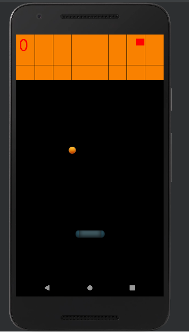
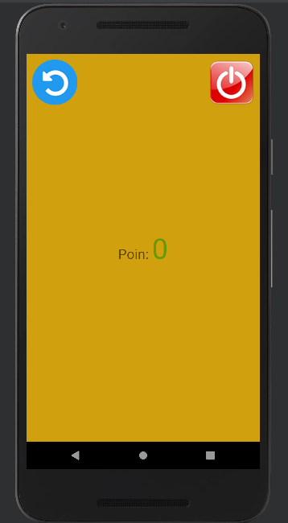

<h1>Kita Brick Breaker Game</h1>

Kita Brick Breaker adalah permainan klasik yang menguji keterampilan dan refleks Anda. Dalam game ini, Anda memiliki sebuah platform yang dapat digerakkan secara horizontal di bagian bawah layar. Tujuan Anda adalah menghancurkan semua batu bata yang ada di atas layar dengan menggunakan bola yang terpantul dari platform.
 
    
    
 

Fitur utama:
    Power-up yang dapat membantu Anda dalam menghancurkan batu bata lebih cepat.
    Sistem skor untuk melacak pencapaian Anda.
Cara Bermain

    Gunakan touchscreen untuk geser layar untuk menggerakkan platform ke kiri dan kanan.
    Permainan dimulai dengan bola yang melaju di platform.
    Arahkan bola untuk memantul dari platform dan menghancurkan batu bata di atas.
    Jaga bola agar tidak jatuh ke bawah. Jika bola jatuh, maka permainan akan berakhir.
    Teruslah menghancurkan batu bata dan kumpulkan poin sebanyak mungkin.
    Jika Anda kehilangan semua nyawa, permainan akan berakhir. Skor tertinggi akan disimpan.

Persyaratan Sistem

    Sistem operasi: Android
Instalasi
    - Download Apk : <a href="https://drive.google.com/file/d/1TSvgvFHOo7NXqErxkSAoUOa1O4rVtE2b/view?usp=sharing">di sini</a>
    - Matikan google protect di play store.(klik icon di play store, masuk ke google protect)
    - Install Apk
    - Mainkan Apk

Terima kasih telah mencoba game Kita Brick Breaker! Jika Anda memiliki masukan, pertanyaan, atau laporan bug, silakan hubungi kami.

Pencatat Skor: Khairil Ilmi
